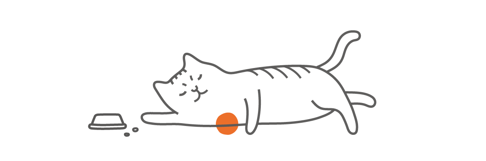
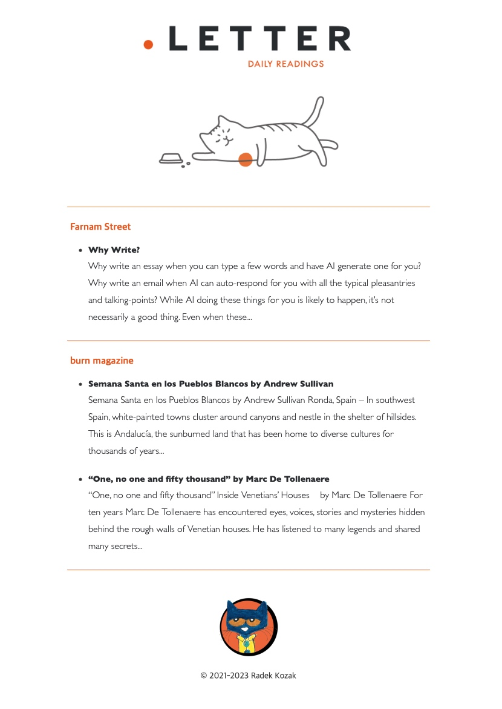

<br>
<p align="center">
<picture>
    <source media="(max-width: 640px)" srcset="assets/letter-header-dark.svg" width="90%">
    
</picture>
</p>
<p align="center">
<picture>
    <source media="(max-width: 640px)" srcset="assets/letter-cat.gif" width="70%">
    
</picture>
</p>
<br><br>

## A minimalistic *cat-like* app that delivers a digest of your RSS feeds as templated newsletter.

<br>

**How it works? Simple!** Every day at 11 am (or at time of your choosing) *letter*  runs on 
the server via `cron` and fetches all your precious RSS feeds to check whether 
there is anything new from yesterday. After some mapping and rendering newsletter digest is created
and sent via e-mail. All in a *catsy* manner. And right into your inbox.


<br>

## Quick howto

_Notice_: Letter assumes your personal `feeds.opml` or `feeds.txt` in `/rss` folder. You can create either one manually or in case of OPML format you can also export it from  preferred service (like Feedly or whatever). OPML is de-facto standard for importing and exporting RSS feeds in such services so it should be relatively easy. 

### Running automatically with Letter Template (easiest and recommeded way)

You can receive your daily readings with Letter automatically by using this [Letter Template](https://github.com/radekkozak/letter-template). Just set up required environment variables and you're good to go. You can also adjust newsletter look to your liking.
   
### Running standalone on your server or local machine

1. Clone repository to desired location
    ```sh
    git clone https://github.com/radekkozak/letter.git
    ```

2. Install
    ```sh
    npm ci
    ```

3. Rename `.env.example` to `.env` and add your own configuration there. 

4. Run one time

    ```sh
    npm run letter
    ```

5. OR run periodically : as described, *letter* is meant to be run at specific schedule. This can easily be achieved via `cron` directive. **Cron tab needs to be created separately**. For example, below settings would run letter every day at 11 o'clock server time (assuming `npm` is correctly in your PATH) 

    ```bash
    0 11 * * * cd /fullpath/to/your/letter/folder && npm run letter
    ```
<br> 

## Email newsletter template

Letter uses [Handlebars](https://handlebarsjs.com) with html extension as default templating engine. Email is generated from `letter` template inside `emails` directory. You can make it your own as you please. Templating
assumes the structure of `html`, `subject` and `text` html files. Here's how *letter* template looks by default:<br><br>

<div align="center">
    
</div>

## Notes

### OPML file structure can be flat or nested

Sometimes certain services like i.e Feedly, export OPML feeds in a nested manner. Letter supports both flat 
and categorized notations. Even in the same file. Please see [feeds.opml.example](https://github.com/letter/rss/feeds.xml.example) . Don't forget to set `LETTER_FEEDS` to `opml` if you choose this format, so Letter knows what file you want it to pick. 

### Gmail considerations

If you use Gmail for sending out the newsletter and your account has Two-Factor Authentication (2FA) enabled you 
need to generate app-specific password which then can be used in place of your regular `SMTP_PASSWORD` variable in `.env` file.

## License

Meow-what ? Cats don't need no stinking licenses. Just be good and state the source of the original cat [wink]. 

## Cats and credits

**I have tried hard to find original authors of cat gif and cat avatar used in the template and header**. Long time ago i found those chucklesome pics sitting in my old computer folder one day and they sparked me to make this simple *why-not* weekend project. Funny enough i found myself using it for this day (What can i say - i just love my RSS readings delivered as email - i'm weird that way) Aaanywho - **if you are the original author of any of these lovely cats, please let me know** so i could give credit where credit is due.     
